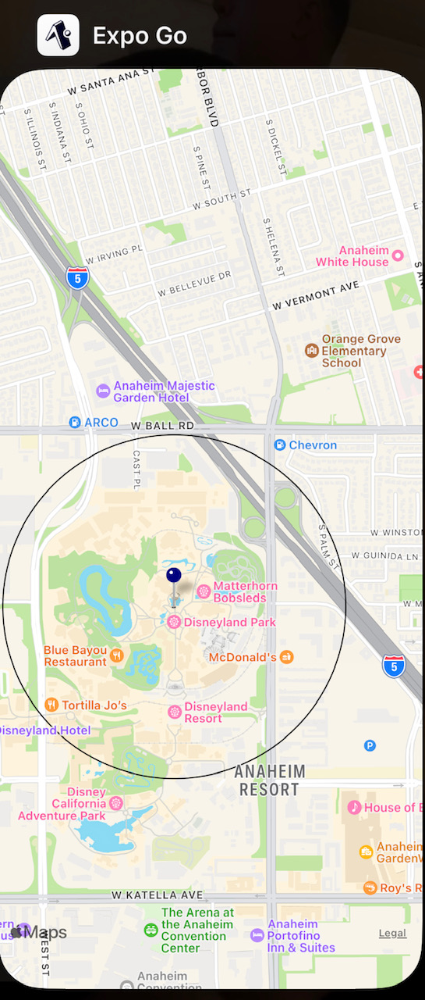
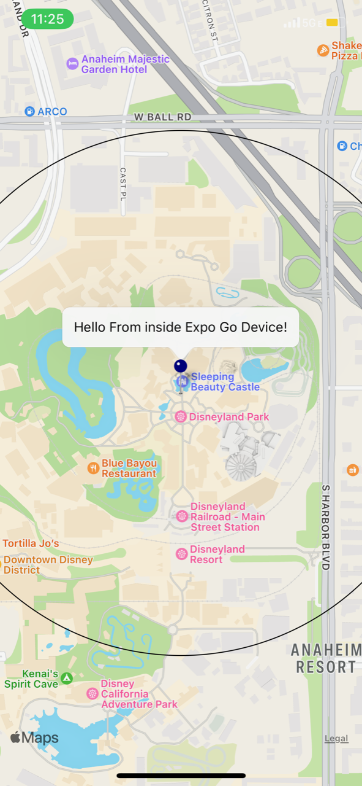

# Lab Class 41

# React Native - Milestone 1: MVP

This is a 2-session assignment, after which you will live-demo your phone app to the class (at the start of class 43)

Lab/Coding Session #1 - Focus on getting your dev system up and operational, getting “proof of life” and reaching your MVP in terms of baseline functionality

Lab/Coding Session #2 - Add in the device features, polish, and prepare for deployments.

# Getting Started

- In Terminal Run
  - npm i
- Then run

  - npm start, a menu in the terminal will display, Press a to open Android
  - scan QR Code on mobile device to open app.
  - ^^NOTE ON THIS^^: right now Im able to run the Google map on the Android device locally, but still need to figure out how to get it work on anyones device. I have inserted screenshots of how it looks on android studios running locally.

  # Local Android device

  
  
